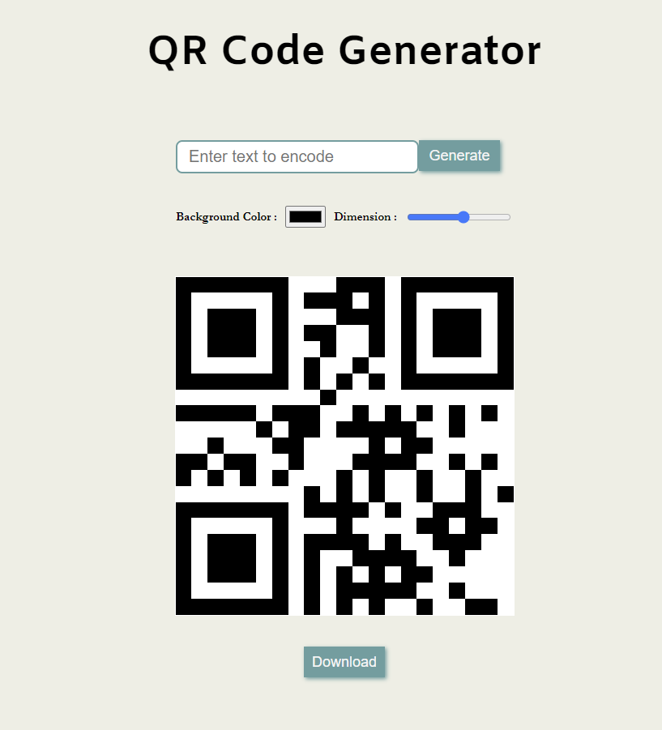

# QR Code Generator
A React-based web application that generates QR codes based on user input. Users can customize the QR code by choosing the background color and teh dimensional size of the QR code.



## How To Run the Project
```
Download or Clone the Repository
	git clone https://github.com/yourusername/QRCode-Generator.git

Navigate to the Project Directory
	cd QRCode-Generator

Ensure Node.js Installed
    npm install

Start Development Server
    npm start

Open in Browser
    Open your browser and go to http://localhost:3000
```

## Technologies Used
- **React** : Front-end library to build user interface
- **HTML** : Used for structuring content page
- **CSS** : For styling components
- **Javascript** : For handling logic
